# MyWave

# 📖 О программе
Приложение для мониторинга вашего самочувствия в течение дня с возможностью просмотра детализированной статистики за выбранные периоды.

## 👨‍💻 iOS Deployment Target: 17.5 

## 💻 Технический стек
- Swift
- UIKit
- MVVM
  
- SnapKit

## 📱 Скриншоты

<h3 align="center">Authorization Screen</h3>

    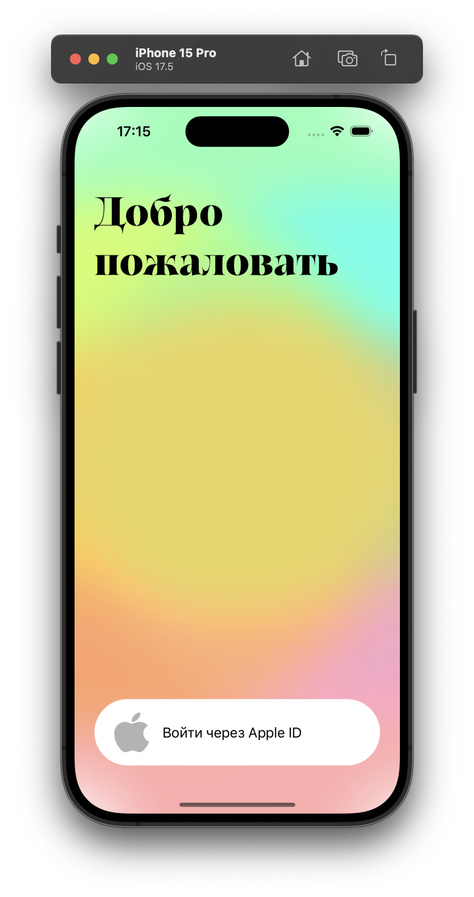

<h3 align="center">Journal Screen</h3>

    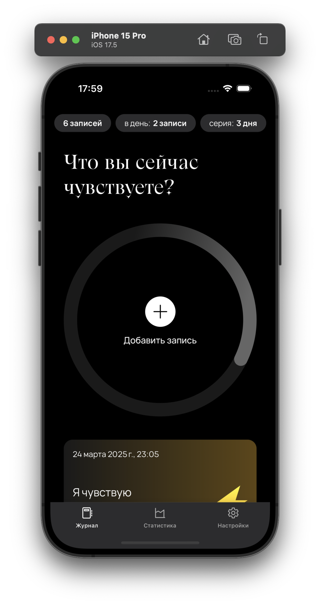
    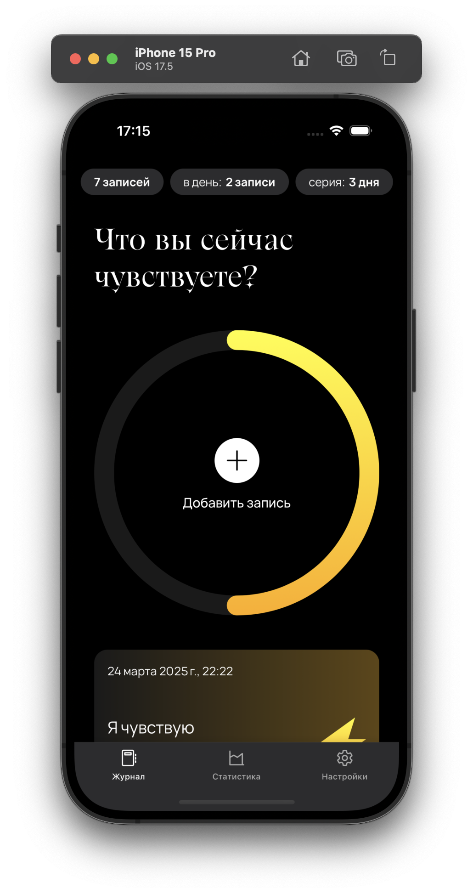
    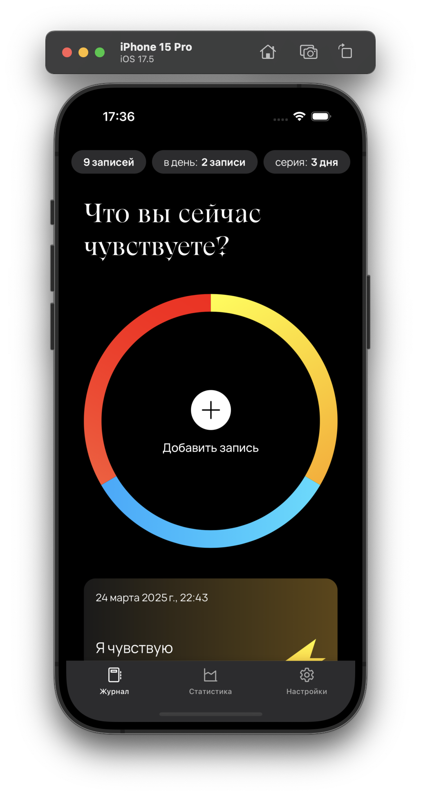

    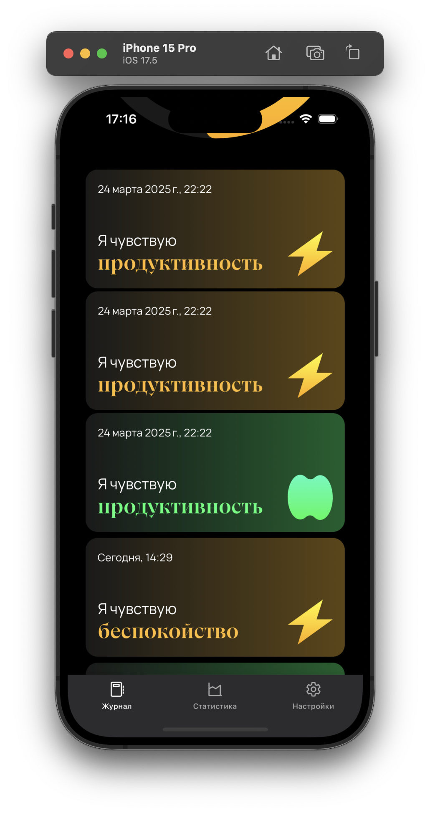

<h3 align="center">Emotion Selection Screen</h3>

    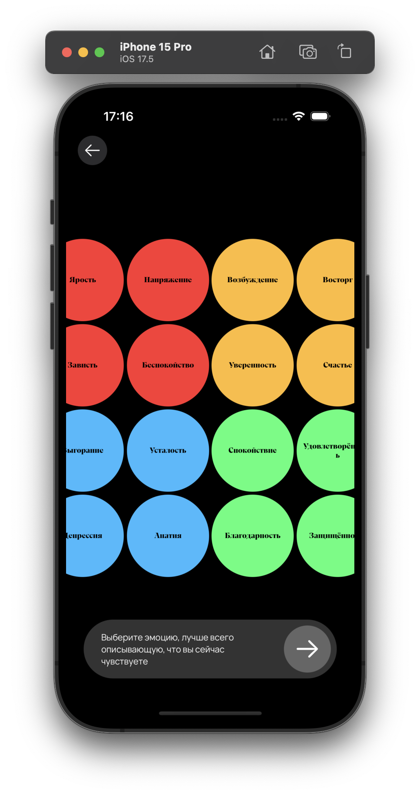
    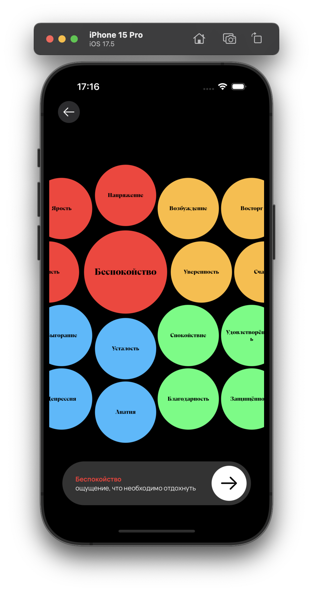

<h3 align="center">Add Note Screen</h3>

    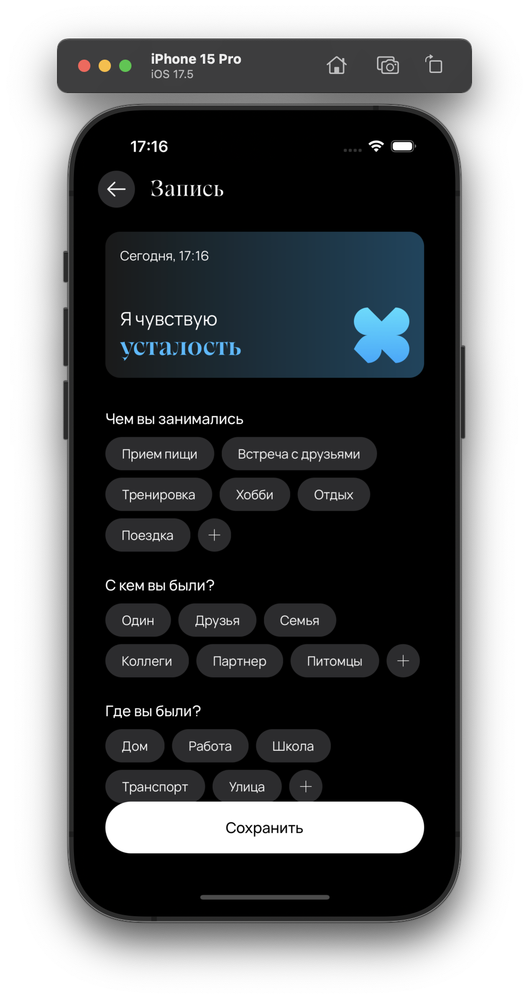
    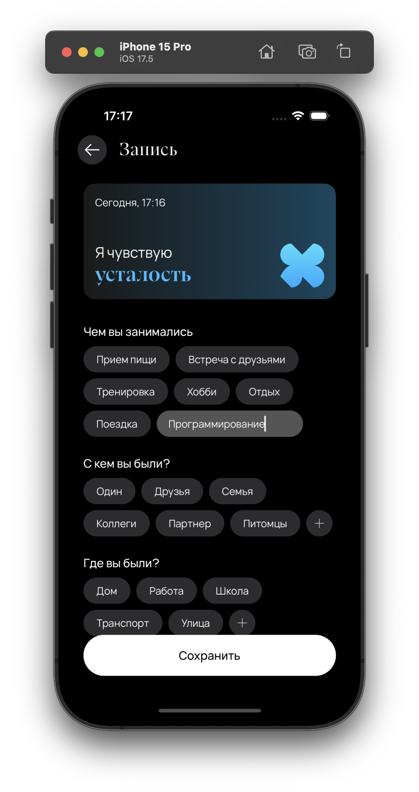
    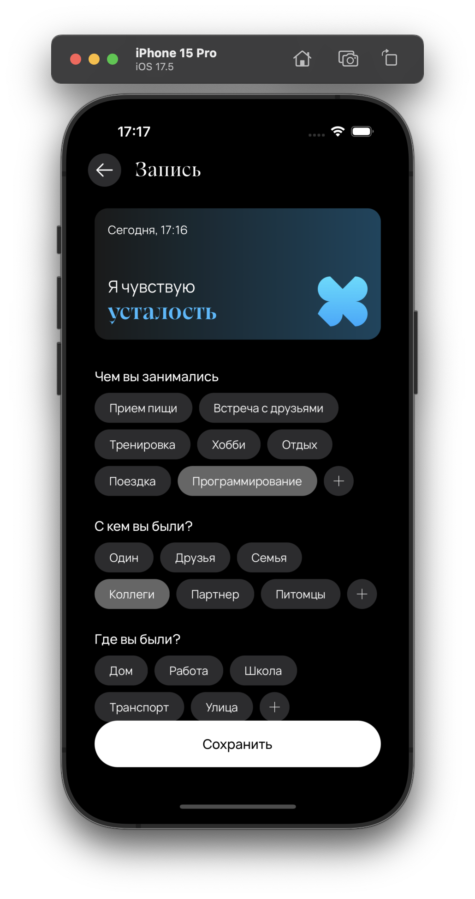

<h3 align="center">Statistics Screen</h3>

    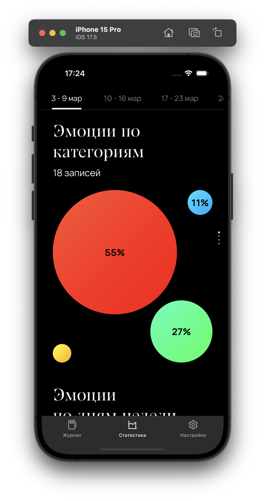
    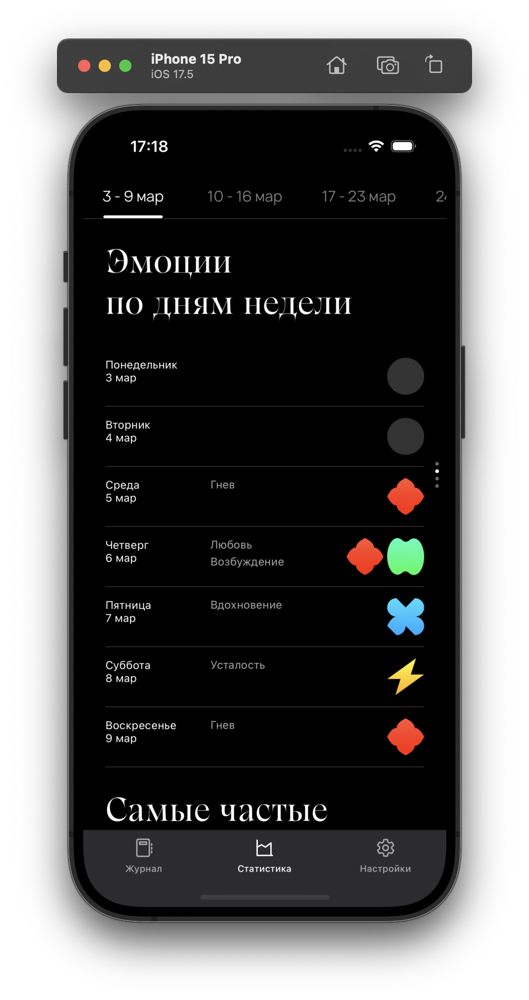
    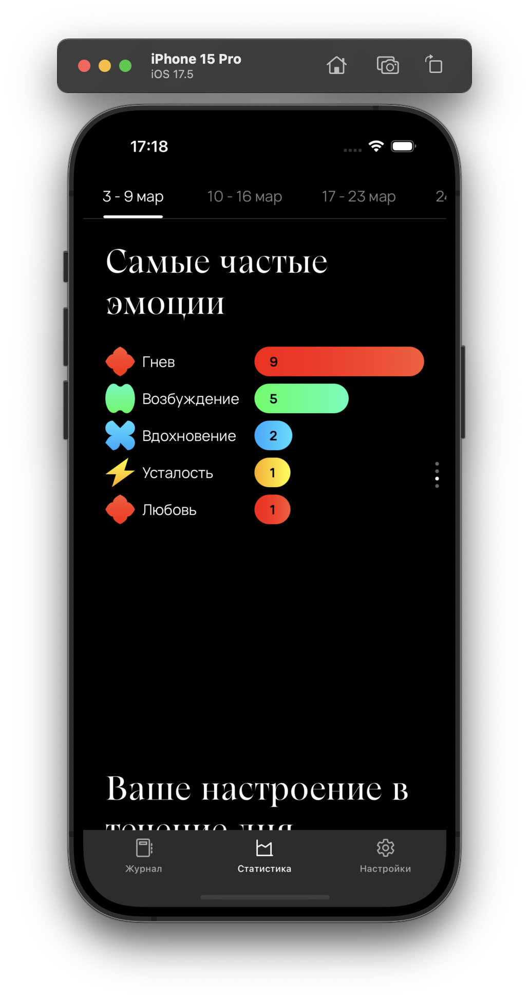
    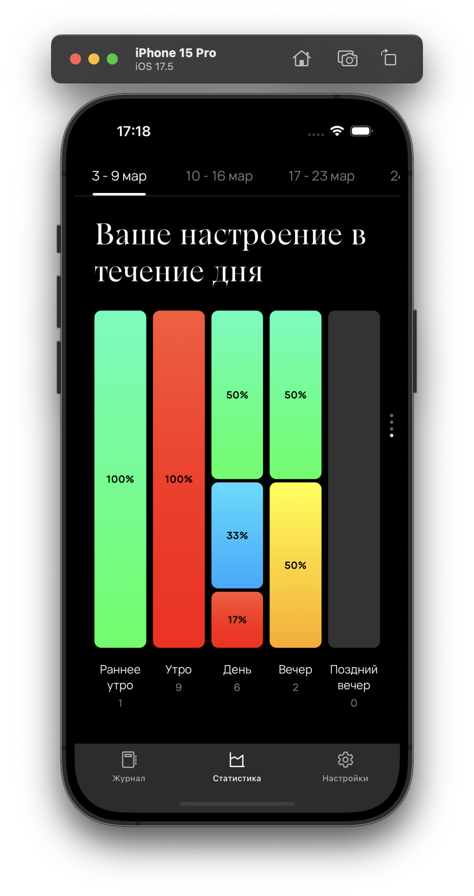

<h3 align="center">Profile Screen</h3>

    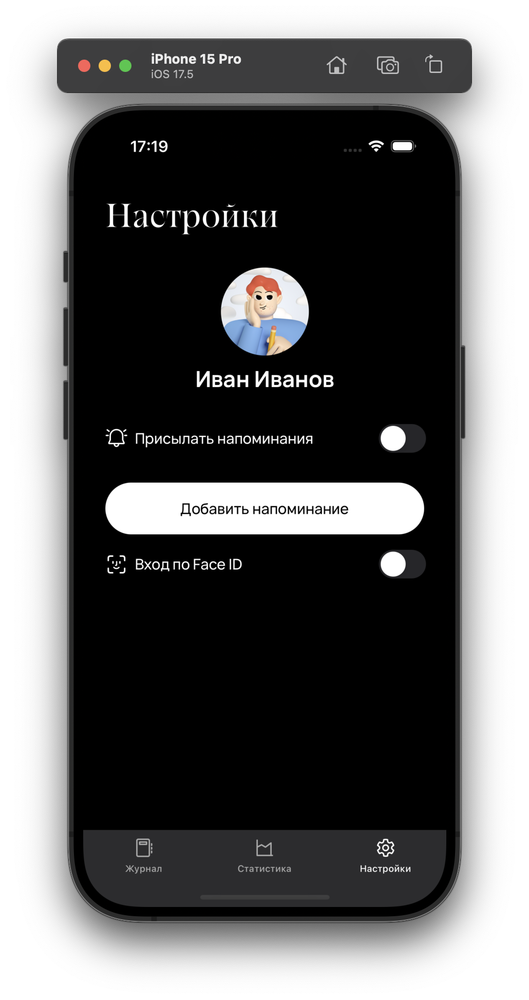
    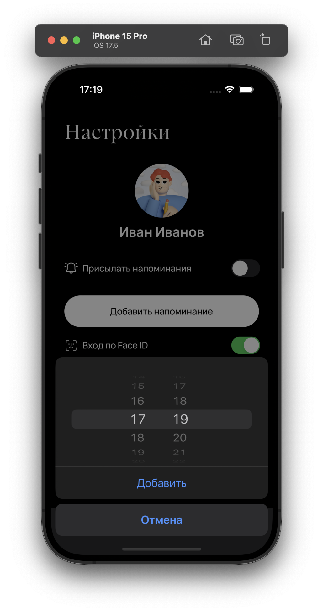
    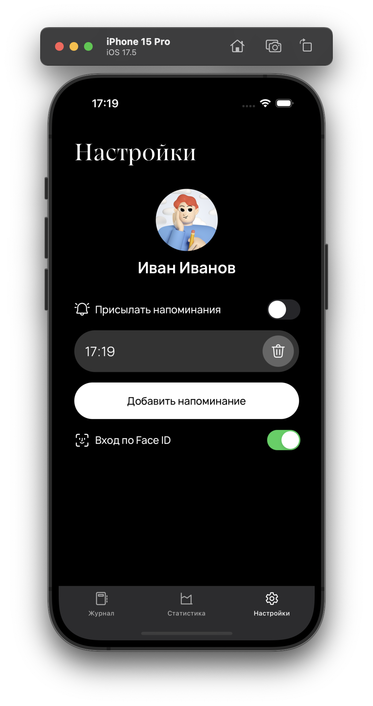

